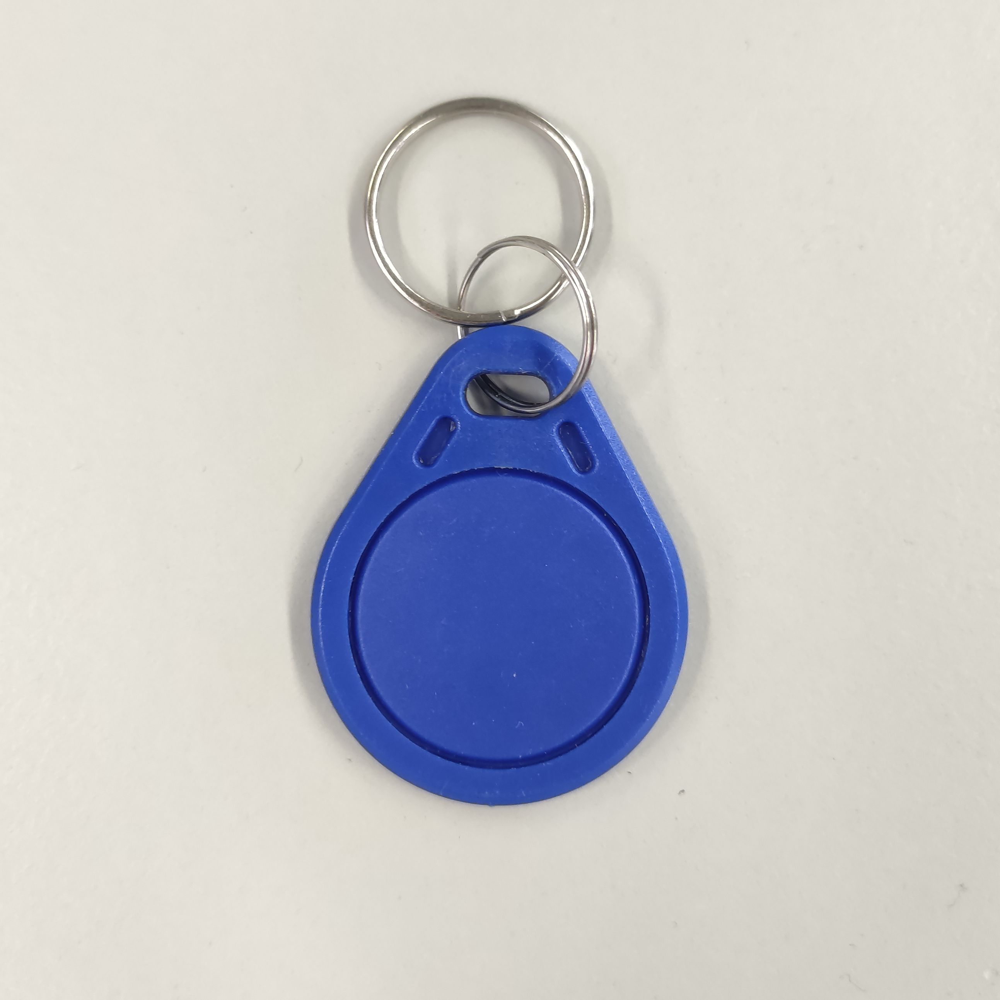
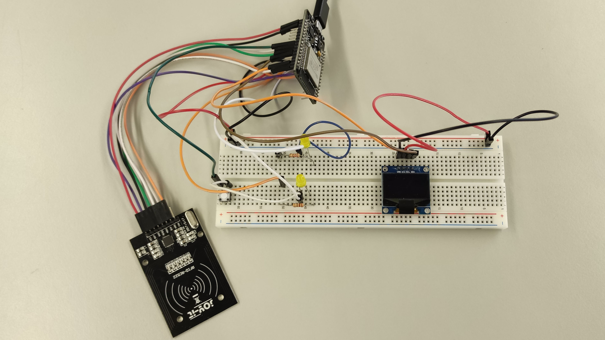
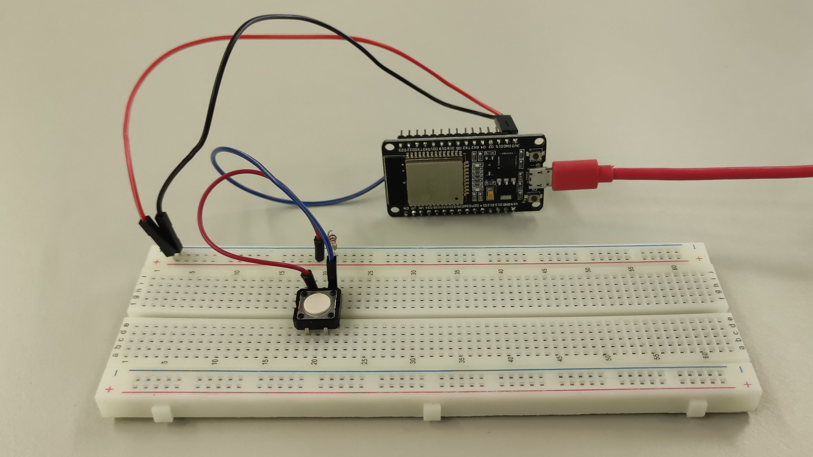
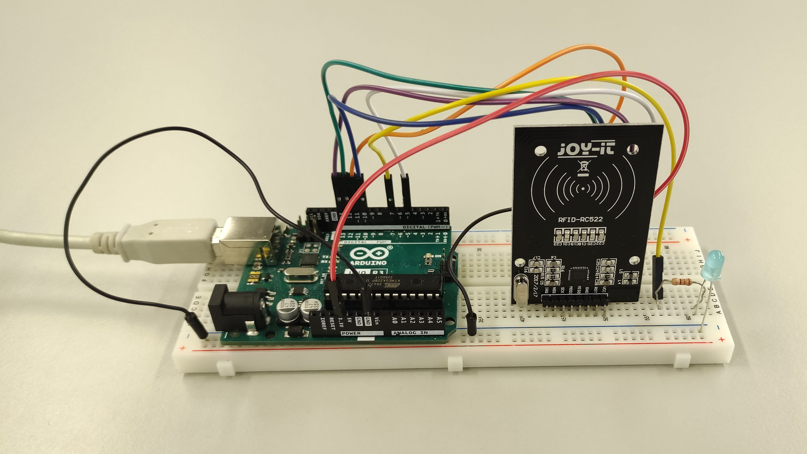
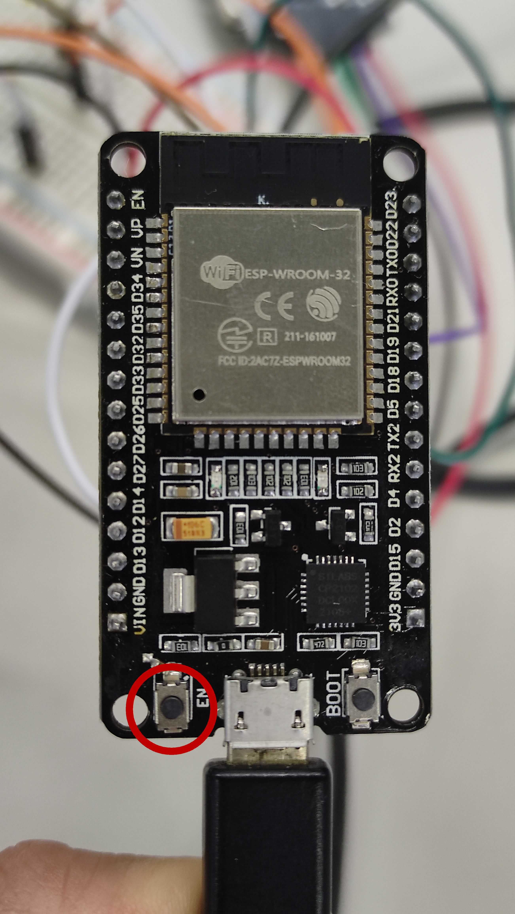

# Blood Mates

#### P4 SS23, Darya Khaylo

---

Blood Mates entstand im Rahmen von P4 im SS23.
Der Code im Repo ergänzt einen Prototyp en zum Projekt. Für eine drahtlose Datenübertragung wird ein ESP32 mit BLE verwendet. Zusätzlich befinden sich an zwei der Stationen RFID-Reader, die Daten auf einem Chip abspeichern bzw. auslesen.

Über einen Sender wird ein Signal an das Schlüsselbrett, welches daraufhin ein Display aktiviert und anzeigt, dass eine Blutspende benötigt wird.
Wenn der/die Nutzende darauffhin zur Blutspende geht, kann er/sie nach Abschluss ihren Schlüsselanhänger dort scannen und der digitale Blutspendeausweis wird aktualisiert.
Wird der Schlüsselanhänger zurück an das Schlüsselbrett gehängt aktiviert sich eine LED.
Die LEDs andere Nutzender aktivieren sich ebenfalls, sobald diese gespendet haben.

Im Prototyp umgesetzt wurde die Systemaktivierung über Bluetooth und das Updaten des Spendestatus in Form eines Scans.
Ebenfalls prototypisch vorhanden ist die Aktivierung der LEDs.

## Aufbau des Prototypen

- [Technik Schema](./aufbau/TechnikSchema.pdf)

- [Pinbelegung](./aufbau/Pinbelegungen.pdf)

### Anhänger

### Schlüsselbrett

### Sender

### Station bei der Spendeeinrichtung

### Bedienung

Vor Start eines Durchlaufes sollte der Reset Button an allen Mikrocontrollern betätigt werden.

Reset auf dem ESP32:

1. Knopf am Sender betätigen
2. Anhänger an der Station scannen
3. Anhänger am Schlüsselbrett scannen
4. Button am Schlüsselbrett bedienen
